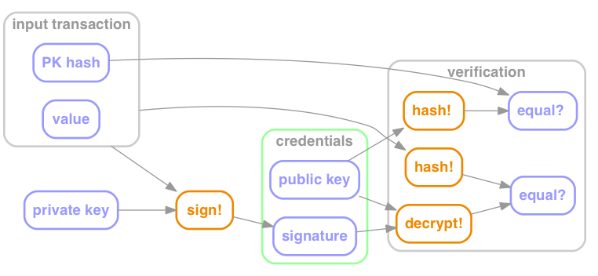
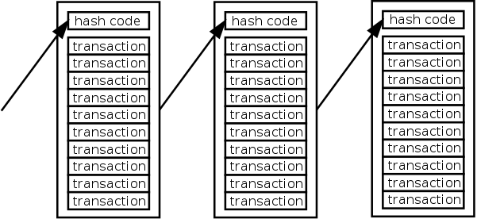
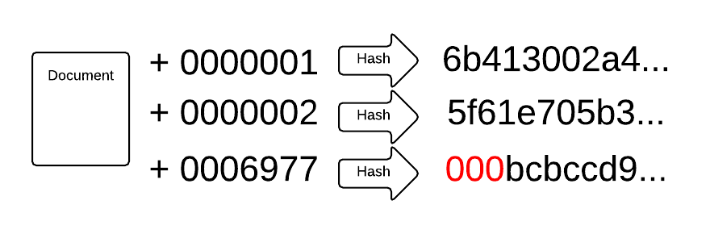

= Bitcoin & Blockchain, 'Splain'd
// asciidoctor -o index.html README.adoc
:source-highlighter: pygments // coderay, highlightjs, prettify, and pygments
:toc:
:toc-placement!:
:toclevels: 2

_View on http://bluegraybox.github.io/BTCSplain/[GitHub Pages]_

toc::[]

Let me start out by clarifying the difference between Bitcoin and Blockchain, in broad strokes, for anyone not familiar with them.
"Bitcoin" is used to refer to both the digital currency - the unit of value - and the software system that allows you to exchange this currency.
I'll use BTC for clarity when referring to the currency.
Mostly, we're going to be talking about the system.

Blockchain is basically a special-purpose distributed database.
It's like an account book - the part of the system that stores transactions - and Bitcoin wraps software around it to control how transactions get added.
Some of that logic is specific to Bitcoin's idea of totally anonymous, decentralized trust.
If you're a group of banks trying to record transactions, or a group of people within an organization, you can still use Blockchain, but wrap different rules around it.

I've been to a number of talks about Bitcoin and Blockchain recently, and I've found them kinda frustrating.
They're given by enthusiasts who go on about all the cool things you'll be able to do with these technologies, how they're going to revolutionize finance and commerce, without explaining how they work.
I understand not wanting to get too deep in the weeds for a general audience, but without a basic grasp of how these technologies work, people can't trust them.
That's a problem because the entire point of Bitcoin is to replace trust in institutions - government and banks - with trust in technology.
If you don't understand the technology, you're trusting the people selling the technology.
And you should always be skeptical of people trying to sell you something.

Spoiler: Bitcoin and Blockchain are not magical, perfect, and flawless.
They have problems - some straightforwardly technical and probably solvable, but some at that tricky and unavoidable intersection of people and technology.

I'm not going to go all that deep, but I want to strip away at least one layer of magic.
Bitcoin builds on a few well-understood cryptographic technologies.
While Bitcoin combines and uses them in new ways, these are the same tools you use every time you go to a secure web site.
They have survived decades of scrutiny.
I trust them.

There are only two fundamental tools, and everything else builds on them.
They are public key cryptography, and hash functions.
They're based on some really complicated math, stuff that's way over my head.
The good news is that you don't have to understand the math, just what it does.

Just a note: I'm going to use words like "never", "impossible", and "cannot".
You should imagine that they always have a little asterisk next to them referring you to a footnote with a long-winded caveat about breakthroughs in fundamental mathematical theory, advances in quantum computing, or mistakes in software implementations.
I'm also going to use words like "unlikely" and "improbable". These are understatements.
They describe probabilities like 1/N where N is the number of atoms in the universe (NoAiU, for later).

== Symmetric Cryptography

In the oldest, simplest forms of cryptography, you take a message and replace each letter in it with a different letter according to some formula.
In short:

****
message -> math! -> encrypted message
****

Here, the math is the secret part. If you know the math, you can decrypt the message.
A classic one is Rot-13, where you "rotate" each letter of the alphabet by 13, so "a" becomes "n", "b" becomes "o", and so on.
To decrypt the message, you just rotate each letter back.
It's a pretty dumb cipher.
Modern encryption is way more sophisticated, but fundamentally it's still:

****
data -> math! -> encrypted data
****

One important innovation is the concept of "keys":

****
data -> math(key)! -> encrypted data
****

Here the math part is not the secret.
In fact, the more public scrutiny it gets, the more trustworthy it is.
What's secret is the key.
Normally (in what we'll now call "symmetric key cryptography") you use the same key for encrypting and decrypting:

****
data -> math(key)! -> encrypted data -> math(key)! -> data
****

The tricky thing with this scheme is getting the key safely to someone else that you want to be able to decrypt your message.

== Public Key Cryptography

In public key cryptography, there are two keys.
You can use either key to encrypt, but anything you encrypt with one can only be decrypted with the other:

****
data -> math(keyA)! -> encrypted data -> math(*keyB*)! -> data +
data -> math(keyA)! -> encrypted data -> math(*keyA*)! -> garbage
****

One of them is private, one is public.
The private key, you have to keep safe and secret. Really, really safe.
The public key, you give out to anyone. Publish it.
Register it with your email address in a public registry.

You can send someone a secret message by encrypting it with their public key.
As long as only they have their private key, only they can decrypt it.
This has two corollaries that we'll come back to later: If they lose their private key, they can't decrypt it; and anyone who steals their private key can.

The other thing you can do is encrypt a message with your private key.
Anyone can decrypt it with your public key, so it's not a secret, but they know that you encrypted it.

We can do both of these in combination.
If I encrypt something with my private key and your public key, only you can read it, and you know it came from me.

How you deal with keys being stolen is a whole topic on its own. We'll get to that later.

== Cryptographic Hash Functions

A hash function is math that takes in data and spits out a single number.
The data can be anything from a single byte to a high-def movie file.

****
data -> math! -> number
****

There are a few key things about this:

* The same data always generates the same number
* It's not reversible - you can't reconstruct the input data from the output number
* Different data can generate the same number (a "collision")

*Cryptographic* hash functions use really sophisticated math to guarantee a few more things:

* Collisions are highly unlikely (again, 1/NoAiU)
* Modifying the data slightly generates a completely different output
* There's no way to predictably modify the data to generate a specific output (to cause a collision)

This gives you a shorthand way to ask, "Have I seen this before?"
It's really useful for two kinds of data: secret things and big things.

So for example, an authentication system could store the hash of a password rather than the password itself.
When someone enters a password, its hash is calculated and compared to the stored value.
If someone steals the stored value, all it lets them do is guess at the password and know if they guessed right.
(They can try a lot of guesses really fast, which is why you need long passwords.)

This also gives you a shortcut for comparing data files: Rather than checking byte by byte, you can calculate the hash of both, and compare those.

For developers, the most familiar use of hashes is Git.
It keeps hashes of files so it knows if they've changed, and each commit is identified by a hash of everything in it.

As another example, I wrote https://gist.github.com/bluegraybox/228fc0ab333d2268f16e3b73c0cc2c36[a tiny Ruby script] to go through all my MP3 files to look for duplicates.
It reads each file, calculates a hash for it, and keeps a look-up table of hashes to file paths.
If the hash is already in the dictionary, it prints out a message with the old and new file paths.

[source,ruby]
----
digests = {}
Find.find( dir ) do |f|
    if File.file?( f ) and File.size?( f ) then
        d = MD5.file( f ).hexdigest
        if digests[d] then
            puts "Duplicates: #{digests[d]} and #{f}"
        else
            digests[d] = f
        end
    end
end
----

== Digital Signatures

As mentioned, I could encrypt a document with my private key, and anyone could decrypt it and verify that it came from me.
But a better option is to run the document through a hash function, then just encrypt the hash value with your private key. That's a digital signature.
The document is readable, but anyone can verify the signature by decrypting it with your public key, hashing the document, and comparing the two.

*Signing*

image:img/signature-1.png[create signature]

*Verification*

image:img/signature-2.png[verify signature]

== Transactions

Ok, now we're getting into the actual bitcoin and blockchain part of this.
It gets a little weird and complicated, so we're going to inch our way toward the truth.

When we talk about bitcoin payments, we imagine that it's like exchanging cash, and a lot of the hype around bitcoin reinforces this.
But that's actually a really misleading metaphor.
The blockchain is a shared ledger.
It's like a big book with every transaction ever written in it.
The only reason it's anonymous "like cash" is that everyone is only identified by their public key.
(And you can use multiple key pairs to muddy the waters a bit.)

What's recorded in the ledger is not "Alice has 200 BTC" or "the owner of key 43b46... has 200 BTC."
It's more like "b05ea... transfered 5 BTC to 43b46..."
The bitcoin you "have" is the sum of all the transfers to you.

When you make a payment, you don't have a pool of money to pay it out of; you have a bunch of individual transactions.
So you have to say something like "take that 5 BTC from transaction 13a16e415d and give it to 72fc388ab6."

When you "spend" a transaction like that, you have to spend all of it, but you can split it up and pay some of it back to yourself.
"From transaction 13a16e415d give 2 BTC to 72fc388ab6 and 3 BTC to 43b46...."

image:img/transactions-1.png[split payment]

You can also do many-to-one or many-to-many transactions.
You can take a bunch of little payments you've received, combine them into one bigger payment to someone else, and pay the difference back to yourself.

image:img/transactions-2.png[many-to-many]

Or just collect them all into a single transaction.

image:img/transactions-3.png[condense]

=== Validation

A Transaction, as it's stored in the blockchain, is a set of inputs and outputs - payments from and to.
Every input is the output from another transaction.

So how is this enforced? What stops you from pretending to be someone else and using their transactions?

The transaction output doesn't just have a public key; it has a little executable script that is used to verify any claims to it.
The script takes a public key and a signature of its own transaction as inputs - that's what you have to provide to claim it.
The script checks that the public key is the one expected, uses that public key to decrypt the signature provided, and compares that to the hash of its own transaction.
That proves that the claimant has the private key matching the pubic key required.
The process is:

In pseudocode, that's:

    function valid(signature, publicKey) {
        return hash(publicKey) == "43b46ef2e61a3d6a725fe70fe2b3adaadbca7348" &&
            decrypt(signature, publicKey) == hash(inputTransactionBytes())
    }

Here's a full example transaction from the https://en.bitcoin.it/wiki/Transaction#Principle_example_of_a_Bitcoin_transaction_with_1_input_and_1_output_only[Bitcoin wiki].
----
Input:
Previous tx: f5d8ee39a430901c91a5917b9f2dc19d6d1a0e9cea205b009ca73dd04470b9a6
Index: 0
scriptSig: 304502206e21798a42fae0e854281abd38bacd1aeed3ee3738d9e1446618c4571d10
90db022100e2ac980643b0b82c0e88ffdfec6b64e3e6ba35e7ba5fdd7d5d6cc8d25c6b241501

Output:
Value: 5000000000
scriptPubKey: OP_DUP OP_HASH160 404371705fa9bd789a2fcd52d2c580b65d35549d
OP_EQUALVERIFY OP_CHECKSIG
----

That's the scripting language at the bottom. It actually includes a hash of the public key, not the full key, which is more anonymous and more compact.
"scriptSig" is the signature and public key that will be fed into the script for the input ("Previous tx").
Also note that the input doesn't have an amount - that comes from previous transaction. ("Index" says which output we're claiming.)

So a chain of transactions could look like:

image:img/transaction.png[transactions]

Ok, fine, so I can create a new transaction that takes Bitcoin that was transfered to me and transfers it to someone else.
And we've got a mechanism so that someone can verify that I'm allowed to do that.
But they need to be able to look up that input transaction.

But there's still the question of who does that verification.
And even if they can prove that this transaction is valid, how do they know there's not already another transaction that uses that input?

For that person to be able to spend it, other people have to be able to verify that transaction.
It only works if we're all using the same big ledger book.
We have all these transactions with their inputs and outputs and little scripts.
How do we keep track of them, and how can we be sure that nobody's fiddled the numbers?

== Blockchain

That question brings us to the actual blockchain.
It's essentially a distributed database of transactions.
Everyone who uses the Blockchain has a copy of it.
If you want to make a change to it, you have to tell everyone else.

Of course, the problem is that everyone is trying to add transactions to it at the same time.
  but the way you add new transactions is interesting.

First off, it's _distributed_, so you have to tell everyone else about any changes you make.

== Proof of Work

So far, there's no reason the blockchain couldn't be a centralized database.
All transactions get sent to it, it validates them and adds them to the blockchain.
Simple.

But the entire point of Bitcoin is to avoid that central authority, that centralized trust.
Everyone has their own copy of the database.
Everyone can validate a block of transactions and send it out to the rest of the network to add to their chains.
But the chain needs to be consistent. Everyone needs to agree on what transactions have happened.
With thousands of people trying to add new blocks to the chain all the time, how do you decide which one to add?
You could choose one at random, but how do you do that if nobody is in charge to do the choosing?

The solution to this problem is what makes Bitcoin Bitcoin, and it's really simple and elegant.
The transaction block consists of all of its transactions plus some metadata.
If you calculate its hash, you'll get an essentially random number.
Remember that's a property of cryptographic hashes, that you can't predict the output, and thus you can't manipulate the input in any predictable way to generate a particular output.

When you look at that random output as a binary number, there's a 50% chance that the first bit will be zero.
There's a 25% chance that the first two bits will be zero, and so on.
By the time you get to 40 bits, you're talking about one in trillion.

So what Bitcoin does is add a nonsense field, a filler field, to the transaction block.
It has no effect except to change the hash value of the block.

Bitcoin then requires that any transaction block hashes to a value with at least a certain number of leading zeros.
To find a filler value that will make the block validate is a matter of brute force guesswork:
Set a new random number, calculate the hash, see if it matches, try again.
Given the total compute power of the network, you can figure out how long it would take to find a hash with a certain number of leading zeros.
The bitcoin software actually adjusts the number of leading zeros required so that the time required to find a valid block remains fairly constant, at around ten minutes.

A nice thing about this is that nobody has to agree in advance what the block of transactions is.
(Since it's a distributed network, everyone will receive transactions in a slightly different order.)
Everyone can work on validating their own block, and whoever generates a valid block first broadcasts it.
Everyone else checks that it's valid and adds it to their chain.
They stop work on their block, discard any transactions that were added in the new block, and start building a new block.

== Smart Contracts
