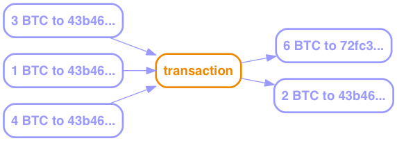

= Bitcoin & Blockchain, 'Splain'd
// asciidoctor -o index.html README.adoc
:toc:
:toc-placement!:
:toclevels: 2

_View on http://bluegraybox.github.io/BTCSplain/[GitHub Pages]_

toc::[]

I've been to a number of talks about Bitcoin and Blockchain recently, and I've found them kinda frustrating.
They're given by enthusiasts who go on about all the cool things you'll be able to do with these technologies, how they're going to revolutionize finance and commerce, without explaining how they work.
I understand not wanting to get too deep in the weeds for a general audience, but without a basic grasp of how these technologies work, people can't trust them.
That's a problem because the entire point of Bitcoin is to replace trust in institutions - government and banks - with trust in technology.
If you don't understand the technology, you're trusting the people selling the technology.
And you should always be skeptical around people trying to sell you something.
That goes double when they're claiming to solve a long-standing human problem.

And I'll tell you now that Bitcoin and Blockchain are not magical, perfect, and flawless.
They have problems - some straightforwardly technical and probably solvable, but some at that tricky and unavoidable intersection of people and technology.

Just a note: I'm going to use words like "never", "impossible", and "cannot".
You should imagine that they always have a little asterisk next to them referring you to a footnote with a long-winded caveat about breakthroughs in fundamental mathematical theory, advances in quantum computing, or mistakes in software implementations.
I'm also going to use words like "unlikely" and "improbable". These are understatements.
They describe probabilities like 1/N where N is the number of atoms in the universe (NoAiU).

I'm not going to go all that deep, but I want to strip away at least one layer of magic.
Bitcoin builds on a few well-understood cryptographic technologies.
While Bitcoin combines and uses them in new ways, these are the same tools you use every time you go to a secure web site.
They have survived decades of scrutiny.
I trust them.

There are only two fundamental tools, and everything else builds on them.
They are public key cryptography, and hash functions.
They're based on some really complicated math, stuff that's way over my head.
The good news is that you don't have to understand the math, just what it does.

== Symmetric Cryptography

In the oldest, simplest forms of cryptography, you take a message and replace each letter in it with a different letter according to some secret formula.
The classic one is called Rot-13, where you just "rotate" each letter of the alphabet by 13, so "a" becomes "n", "b" becomes "o", and so on.
To decrypt the message, you just rotate each letter back by 13.
In short:

****
message -> math! -> encrypted message
****

Modern encryption is way more sophisticated, but fundamentally it's still:

****
data -> math! -> encrypted data
****

One thing that's been added is the concept of "keys":

****
data -> math(key)! -> encrypted data
****

Here the math part doesn't have to be secret (and the more public scrutiny it gets, the more trustworthy it is).
What's secret is the key.
Normally (in what we'll now call "symmetric key cryptography") you use the same key for encrypting and decrypting:

****
data -> math(key)! -> encrypted data -> math(key)! -> data
****

The tricky thing with this scheme is getting the key safely to someone else that you want to be able to decrypt your message.

== Public Key Cryptography

In public key cryptography, there are two keys.
You can use either key to encrypt, but anything you encrypt with one can only be decrypted with the other:

****
data -> math(keyA)! -> encrypted data -> math(*keyB*)! -> data +
data -> math(keyA)! -> encrypted data -> math(*keyA*)! -> garbage
****

One of them is private, one is public.
The private key, you have to keep safe and secret. Really, really safe.
The public key, you give out to anyone. Publish it.
Register it with your email address in a public registry.

You can send someone a secret message by encrypting it with their public key.
As long as only they have their private key, only they can decrypt it.
Two points that we'll come back to later: If they lose their private key, they can't decrypt it; and anyone who steals their private key can decrypt it.

The other thing you can do is encrypt a message with your private key.
Anyone can decrypt it with your public key, so it's not a secret, but they know that you encrypted it.

We can do both of these in combination.
If I encrypt something with my private key and your public key, only you can read it, and you know it came from me.

How you deal with keys being stolen is a whole topic on its own. We'll get to that later.

== Cryptographic Hash Functions

A hash function is math that takes in data and spits out a single number.
The data can be anything from a single byte to a high-def movie file.

****
data -> math! -> number
****

There are a few key things about this:

* The same data always generates the same number
* It's not reversible - you can't reconstruct the input data from the output number
* Different data can generate the same number (a "collision")

*Cryptographic* hash functions use really sophisticated math to guarantee a few more things:

* Collisions are highly unlikely (again, 1/NoAiU)
* Modifying the data slightly generates a completely different output, and its corollary,
* There's no way to predictably modify the data to generate a specific output

This gives you a shorthand way to ask, "Have I seen this before?"
It's really useful for two kinds of data: secret things and big things.

So for example, an authentication system could store the hash of a password rather than the password itself.
When someone enters a password, its hash is calculated and compared to the stored value.
If someone steals the stored value, all it lets them do is guess at the password and know if they guessed right.
(They can try a lot of guesses really fast, which is why you should have long passwords that are not normal words.)

This also gives you a shortcut for comparing data files: Rather than checking byte by byte, you can calculate the hash of both, and compare those.
For example, I wrote a tiny Ruby script that went through all my MP3 files to look for duplicates.
It read each file, calculated a hash for it, and used that as the key for a dictionary of file paths.
If the hash was already in the dictionary, it printed out a message with that file path and the new one saying they were duplicates.

== Digital Signatures

As mentioned, I could encrypt a document with my private key, and anyone could decrypt it and verify that it came from me.
But a better option is to run the document through a hash function, then just encrypt the hash value with your private key. That's a digital signature.
The document is readable, but anyone can verify the signature by decrypting it with your public key, hashing the document, and comparing the two.

*Signing*

image:img/signature-1.png[create signature]

*Verification*

image:img/signature-2.png[verify signature]

== Transactions

Ok, now we're getting into the actual bitcoin and blockchain part of this.
It gets a little weird and complicated, so we're going to inch our way toward the truth.

When we talk about bitcoin payments, we imagine that it's like exchanging cash, and a lot of the hype around bitcoin reinforces this.
But that's actually a really misleading metaphor.
The blockchain is a shared ledger.
It's like a big book with every transaction ever written in it.
The only reason it's anonymous "like cash" is that everyone is only identified by their public key.
(And you can use multiple key pairs to muddy the waters a bit.)

What's recorded in the ledger is not "Alice has 200 BTC" or "the owner of key 43b46ef2e6 has 200 BTC".
It's more like "b05eaffdb5 transfered 5 BTC to 43b46ef2e6".
The bitcoin you "have" is the sum of all the transfers to you.

When you make a payment, you don't have a pool of money to pay it out of; you have a bunch of individual transactions.
So you have to say something like "take that 5 BTC from transaction 13a16e415d and give it to 72fc388ab6."

When you "spend" a transaction like that, you have to spend all of it, but you can split it up and pay some of it back to yourself.
"From transaction 13a16e415d and give 2 BTC to 72fc388ab6 and 3 BTC to 43b46ef2e6."

image:img/transactions-1.png[split payment]

You can also do many-to-one or many-to-many transactions.
You can take a bunch of little payments you've received, combine them into one bigger payment to someone else, and pay the difference back to yourself.

A Transaction, as it's stored in the bitcoin system, is a set of inputs and outputs - payments from and to.
Every input is the output from another transaction.

So how is this enforced? What stops you from pretending to be someone else and using their transactions?

The transaction output doesn't just have a public key; it has a little executable script that is used to verify any claims to it.
The script takes a public key and a signature of its own transaction as inputs - that's what you have to provide to claim it.
The script checks that the public key is the one expected, uses that public key to decrypt the signature provided, and compares that to the hash of its own transaction.
That proves that the claimant has the private key matching the pubic key required.
The process is:

In pseudocode, that's:

    function valid(signature, publicKey) {
        return hash(publicKey) == "43b46ef2e61a3d6a725fe70fe2b3adaadbca7348" &&
            decrypt(signature, publicKey) == hash(inputTransactionBytes())
    }

And the actual scripting langauge looks like this:

    OP_DUP OP_HASH160 43b46ef2e61a3d6a725fe70fe2b3adaadbca7348 OP_EQUALVERIFY OP_CHECKSIG

(The script actually includes a hash of the public key, not the full key, which is safer and more compact.)

So a chain of transactions could look like:

image:img/transaction.png[transactions]

Ok, fine, so we have all these transactions with their inputs and outputs and little scripts.
Who actually verifies them, and how do we keep someone from fiddling with the numbers?

== Blockchain

image:img/blockchain.png[blockchain]

== Proof of Work

Bitcoin only.

image:img/proof_of_work.png[proof of work]

== Smart Contracts
