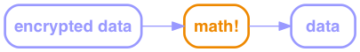

# Bitcoin & Blockchain Fundamentals

---

# OMG Revolution!!!


---

# What Even?
* Bitcoin - unit of value (BTC)
* Bitcoin - system of exchange
* Blockchain - transaction database

---

# Magic


---

# Cryptography



<!-- .element: class="fragment" data-fragment-index="1" -->

---

# Symmetric-Key Cryptography


<!-- .element: class="fragment" data-fragment-index="1" -->

---

# Public Key Cryptography


<!-- .element: class="fragment" data-fragment-index="1" -->

---

# Cryptographic Hash Functions


* Fixed-size number
* Not invertible
* Collisions are highly unlikely (1/10<sup>48-77</sup>)
* Not predictable

---

# Common Uses

* Passwords
* File comparison (Git)
* Data integrity

---

# Digital Signatures

Signing


Verification
<!-- .element: class="fragment" data-fragment-index="1" -->


<!-- .element: class="fragment" data-fragment-index="1" -->

---

# Blockchain

* Specialized database for transactions
* Pseudonymous, by hash of public key
* Transactions only, no account balance

---

# Transactions


* Many to Many
* Whole value of input must be accounted for

---

# Validation

To spend an input transaction, you have to
* Prove that it's yours
* Prove that you're you

---

# Validation

Claimant


---

# Validation

Verifier/Miner - Step 1


---

# Validation

Verifier/Miner - Step 2


---

# Validation


---

# Validation

```javascript
function valid(signature, publicKey) {
    return hash(publicKey) ==
            "404371705fa9bd789a2fcd52d2c580b65d35549d" &&
        decrypt(signature, publicKey) ==
            hash(thisTransactionBytes())
}
```

---

# Validation

```none
Input:
Previous tx: f5d8ee39a430901c91a5917b9f2dc19d6d1a0e9cea205b009ca73dd04470b9a6
Index: 0
scriptSig: 304502206e21798a42fae0e854281abd38bacd1aeed3ee3738d9e1446618c4571d10
90db022100e2ac980643b0b82c0e88ffdfec6b64e3e6ba35e7ba5fdd7d5d6cc8d25c6b241501

Output:
Value: 5000000000
scriptPubKey: OP_DUP OP_HASH160 404371705fa9bd789a2fcd52d2c580b65d35549d OP_EQUALVERIFY OP_CHECKSIG
```

---

# Transactions


---

# Blockchain Blocks


---

# Blockchain Indexing

* Efficient validation
* Prevent double-spend


---

# _Distributed_ Trust

---

# Proof of Work

(Bitcoin-specific)


---

# Private Blockchains

* Consensus, not proof-of-work – fast
* Not anonymous
* Legal governance
* E.g. property titles, inter-bank settlement

---

# Smart Contracts

* N-of-M signers (arbitrated)
* Automated signing service
* Kickstarter
* Future payments: escrow, refundable deposit
* Caveats

---

# Human Problems

* Key management
* Ooops
* Fraud
* Implementation mistakes

---

# System Problems

* Storage
* Throughput

---

# Caveats

* Mathematical breakthroughs
* Quantum computing

---

# Q&A

---

# Thanks!

* Colin.MacDonald@CapitalOne.com
* Slides: http://bluegraybox.github.io/BTCSplain/slides/
* Write-up: http://bluegraybox.github.io/BTCSplain/
