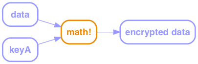

# Bitcoin & Blockchain Fundamentals

---

# OMG Revolution!!!


---

# What Even?
* Bitcoin unit of value – BTC
* Bitcoin system of exchange
* Blockchain – distributed ledger

---

# Magic


---

# Caveats

* breakthroughs in fundamental mathematical theory
* advances in quantum computing
* mistakes in software implementations

---

# Cryptography


---

# Symmetric Cryptography


---

# Public Key Cryptography




---

# Cryptographic Hash Functions


* Fixed-size number
* Not invertible
* Collisions are highly unlikely (1/NoAiU)
* Not predictable

---

# Uses

* Passwords
* File comparison (Git)
* Data integrity

---

# Digital Signatures

Signing


Verification


---

# Transactions

* public record
* pseudonymous
    * e.g. 404371705fa9bd789a2fcd52d2c580b65d35549d
* transactions, not account w/ balance

---

# Transactions

Whole value of input must be accounted for


---

# Transactions

Many to Many


---

# Transactions

* To spend your BTC, you have to
* Say which transaction it came from
* Prove that you’re you

---

# Validation

Claimant


---

# Validation

Verifier/Miner


---

# Validation

Verifier/Miner


---

# Validation


---

# Validation

```javascript
function valid(signature, publicKey) {
    return hash(publicKey) ==
            "43b46ef2e61a3d6a725fe70fe2b3adaadbca7348” &&
        decrypt(signature, publicKey) ==
            hash(inputTransactionBytes())
}
```

---

# Validation

```
Input:
Previous tx: f5d8ee39a430901c91a5917b9f2dc19d6d1a0e9cea205b009ca73dd04470b9a6
Index: 0
scriptSig: 304502206e21798a42fae0e854281abd38bacd1aeed3ee3738d9e1446618c4571d10
90db022100e2ac980643b0b82c0e88ffdfec6b64e3e6ba35e7ba5fdd7d5d6cc8d25c6b241501

Output:
Value: 5000000000
scriptPubKey: OP_DUP OP_HASH160 404371705fa9bd789a2fcd52d2c580b65d35549d OP_EQUALVERIFY OP_CHECKSIG
```

---

# Transactions


---

# Blockchain


---

# Indexing

* Efficient validation
* Prevent double-spend


---

# _Distributed_ Trust

---

# Proof of Work

(Bitcoin-specific)


---

# Smart Contracts

* N-of-M signers (arbitrated)
* Automated signing service
* Kickstarter
* Future payments: escrow, refundable deposit
* Caveats

---

# Problems

* Key management
* Ooops
* Fraud
* Storage
* Throughput

---

# Potential

* Property Titles
* Distributed System of Record

---

# Q&A

* Property Titles
* Distributed System of Record

---

# Thanks!

* Colin.MacDonald@CapitalOne.com
* Slides: http://bluegraybox.github.io/BTCSplain/slides/
* Write-up: http://bluegraybox.github.io/BTCSplain/
